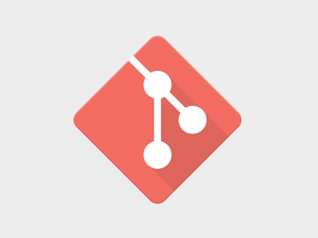

# Инструкция по работе с git
*Для начала работы с системой контроля вресий git
необходимо создать на локальном или удаленном ресурсе папку в которой будет находиться редактируемый проект и файлы используемые в нем.
Открыть папку в Visual studio code, и использовать терминал для ввода команд.*

## Первым шагом будет инциализация программы в рабочую папку. 
* *Для этого используется команда:*

> **git init**

## Для последующей корректной работы с гитом необходимо указать имя пользоваетля и электронную почту аккаунта github для работы с удаленными репозиториями.
* *Для этого используются следующие команды:*

> **git config --global "user.name"**.

> **git config --global user@email.com**

## Работа программы производится с помощью учёта отслеживаемых файлов и фиксации их измениения.

* *Что бы добавить файл в отслеживаемые используется команда:*

> **git add**

* *Также есть возможность добавить все файлы которые находятся в рабочей папке, для этого используется команда:*

> **git add .**

* *Для фиксации измений в файле используется команда:*

> **git commit -m "Комментарий к изменению"**

*Важный нюанс при работе с программой заключается в том, что при любом измении файла в котором идет работа необходимо сообщать об этом программе по средствам команды git add. В случае если этот шаг пропустить изменение в git зафиксировать неудастся.*
* Для оценки текущего сосотояния работы программы используется команда:
> **git status**

## Git ведет журнал зафиксированных пользователем изменений с выводом комментария к ним и возможностью вернуть файл в состояние того или иного уровня изменений.

* *Для вызова журнала изменений используется команда:*

> **git log**

 **У каждого изменения есть свой хэш-код с помощью которого можно вернуть проект в сосотояние сохраненное на момент фиксации изменения.** 

* *Это производится с помощью первых пяти символов кода и команды:*

> **git checkout** 

**Так же эта команда используется для переключения в системе ветвления git, только вместо пяти символов кода используется имя ветки.**

* *Чтобы вернуть документ в сосотояние последнего изменнения используется команда:*
> **git switch -**

## Git позволяет работать с документом в структурном режиме с помощью системы ветвления.

* *для создания ветви используется команда:*
> **git branch** имя ветви

**для просмотра структуры ветвления достатоно команды использующейся для создания ветви без ввода ее имени.** 

 Создавая новую ветвь при работе с документом в нее будет перенесен файл в текущем состоянии. В дальнейшем изменения в файле и  результаты их фиксации будут доступны только по адресу ветви в которой они фиксируются.

* *Для слияния ветвей используется команда:*
> **git merge**

* *Для удаления ветви используется команда:*
> **git branch -d** имя ветви

* *Для вызова журнала с изменениями с учетом ветвления файла используется команда:*
> **git log --graph**
## Работа с удаленными репозиториями с помощью github

* *Для загрузки удаленного репозитория на локальный диск используется команда:*

> **git clone**

**С указанием ссылки на репозиторий**

* Для связки локального репозитория с удаленным используется команда:
> **git remote add**

**Также с указанием ссылки**
* *И для отправки локальной версии файла на github используется команда:*
> **git push -u**

[Itsgithub](https://github.com/)

## Основные команды третьего семинара по git

> git push
